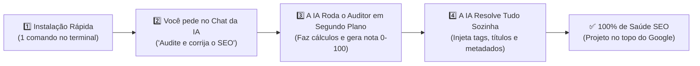

<div align="center">

# 🚀 SEO-FORGE
### O Kit Definitivo de SEO, Redes Sociais e Inteligência Artificial (GEO) para o seu Site ou Sistema
**Apareça no topo do Google, seja citado pelo ChatGPT/Perplexity e compartilhe links impecáveis no WhatsApp em minutos.**

[](LICENSE)
[](https://dotnet.microsoft.com/)
[](https://dotnet.microsoft.com/apps/aspnet/web-apps/blazor)
[](https://github.com/CW-Software-Apps/seo-forge)
[](https://claude.ai/)
[](https://deepmind.google/)
[](https://cursor.com/)

<p align="center">
  <b>Criado e mantido com carinho pela equipe da <a href="https://cwsoftware.com.br">CW Software</a></b>
</p>

---

[🇧🇷 Guia em Português](#-guia-em-português) • [💡 O que é?](#-1-o-que-é-o-seo-forge) • [🛠️ Passo a Passo Completo](#-3-passo-a-passo-completo-do-zero-ao-100) • [🤖 Como Usar com sua IA](#-4-como-fazer-a-ia-resolver-tudo-por-você) • [❓ Perguntas Frequentes](#-6-perguntas-frequentes-faq) • [🇺🇸 English Guide](#-english-quick-guide)

---

</div>

# 🇧🇷 Guia em Português

---

## 💡 1. O que é o SEO-FORGE?

Imagine que você acabou de criar um site ou sistema incrível (em **Blazor**, **.NET**, **HTML**, etc.). Porém:
1. **No Google:** Ninguém acha seu site, ou ele aparece com um título esquisito e sem descrição.
2. **Nas Redes Sociais:** Quando você manda o link no **WhatsApp**, **LinkedIn** ou **Twitter**, não aparece aquela imagem bonita com o resumo do que você faz — fica só um link cinza e sem graça.
3. **Nas IAs (ChatGPT, Perplexity, Copilot):** Quando alguém pergunta sobre sua empresa ou serviço, as IAs não sabem quem você é porque seu site não tem dados estruturados.
4. **Indexação Lenta:** O Google e o Bing levam semanas ou meses para perceber que você criou páginas novas.

O **SEO-FORGE** resolve **tudo isso de uma vez só**. 

Ele é uma ferramenta gratuita que:
- **Analisa seu projeto inteiro em segundos** e dá uma nota de saúde de 0 a 100.
- **Diz exatamente o que está faltando** (títulos, descrições, imagens de redes sociais, sitemap, etc.).
- **Gera um relatório completo com instruções prontas** para você pedir para a sua Inteligência Artificial favorita (**OpenCode**, **Claude Code**, **Antigravity**, **Cursor**) resolver tudo automaticamente com copywriting de alta qualidade.

---

## ⚙️ 2. Como Funciona? (O Ciclo em 3 Passos)

Você **não precisa ser especialista em SEO e nem precisa ficar rodando comandos na mão se não quiser**:



### ✨ A Maneira Mais Fácil: Deixe a IA Fazer Tudo por Você
Depois de instalar o kit no projeto, você **não precisa abrir terminal para nada**. Basta digitar no chat da sua IA:

> 💬 *"Audite o SEO deste projeto e me diga como está."*  
> ou  
> 💬 *"Corrija todo o SEO deste projeto até ficar 100% perfeito."*

A própria IA (OpenCode, Claude, Cursor, Antigravity) tem ferramentas integradas para **executar o auditor em segundo plano**, calcular as métricas, ler o relatório e já começar a editar os arquivos com inteligência e textos de alta conversão!

---

## 🛠️ 3. Passo a Passo Completo (Do Zero ao 100%)

### 1️⃣ Passo Único de Instalação no Projeto

Abra o terminal na pasta raiz onde fica o código do seu site/sistema e execute apenas este comando:

#### No Windows (PowerShell):
```powershell
irm https://raw.githubusercontent.com/CW-Software-Apps/seo-forge/main/install.ps1 | iex
```

#### No Linux ou macOS (Bash):
```bash
curl -fsSL https://raw.githubusercontent.com/CW-Software-Apps/seo-forge/main/install.sh | bash
```

> 💡 **O que este comando faz automaticamente em 3 segundos?**
> - Injeta os componentes prontos `<SeoHeader.razor>`, `<JsonLd.razor>` e `IndexNowService.cs` (em projetos Blazor/.NET).
> - Cria o auditor `scripts/seo_checker.py`.
> - Cria as regras e instruções automáticas para todas as IAs (`AGENTS.md`, `CLAUDE.md`, regras do Cursor).

---

### 2️⃣ Como Usar: O Modo 100% Automático no Chat (Recomendado)

Depois de rodar o instalador, você **não precisa mais abrir o terminal**! Abra o chat da sua IA (**OpenCode**, **Claude Code**, **Antigravity**, **Cursor**) e simplesmente fale:

#### Se você só quiser ver a nota e os problemas:
> 💬 *"Audite o SEO deste projeto e me dê o diagnóstico com a nota de saúde."*

A IA executa o auditor em segundo plano, lê as 30+ métricas e te responde na hora com o score (0 a 100) e os pontos que precisam de atenção.

#### Se você quiser que a IA corrija TUDO até 100%:
> 💬 *"Corrija todo o SEO deste projeto até a nota atingir 100%."*

A IA roda o auditor em background, detecta as páginas que faltam títulos/descrições/Open Graph, edita cada arquivo com textos atrativos de alta conversão, ajusta cabeçalhos `<h1>`, adiciona `alt` em imagens e re-audita até atingir nota **100/100 A+**!

---

### 3️⃣ Modo Manual (Opcional - Para quem prefere o terminal)

Se você preferir rodar a verificação manualmente na linha de comando em vez de pedir para a IA:

```bash
python scripts/seo_checker.py .
```

O auditor vai escanear todos os arquivos e exibir o painel com a nota e salvar o relatório em `seo_report.md`:

```text
======================================================================
  🚀 SEO-FORGE 360° - Diagnostic Engine & AI Action Planner
  CW Software (https://cwsoftware.com.br)
======================================================================
Projeto: C:\MeuProjetoWeb
Data:    05/09/2026

📊 SCORE GERAL DE SAÚDE SEO: 72/100 - C (Requer Atenção)

┌────────────────────────────────────────────────────────────────────┐
│ 🏗️  INFRAESTRUTURA TÉCNICA & CRAWLABILITY (Peso: 35%)              │
├────────────────────────────────────────────────────────────────────┤
│  ⚠️ Robots.txt                       Ausente: arquivo não encontrado │
│  ⚠️ Sitemap.xml                      Ausente: sitemap não encontrado │
│  ✅ Blazor SSR (<HeadOutlet />)      Presente no App.razor           │
│  ⚠️ Dados Estruturados (JSON-LD)     Ausente                         │
└────────────────────────────────────────────────────────────────────┘

┌────────────────────────────────────────────────────────────────────┐
│ 🏷️  AUDITORIA ON-PAGE & REDES SOCIAIS (Peso: 65%)                  │
├────────────────────────────────────────────────────────────────────┤
│  Páginas Analisadas: 15    | Em Conformidade: 4    | Com Falhas: 11 │
└────────────────────────────────────────────────────────────────────┘

📄 Relatório de diagnóstico salvo em: seo_report.md
```

Você pode abrir o `seo_report.md` para ver a tabela detalhada de cada página, ou simplesmente deixar a IA resolver tudo no chat.

---

### 4️⃣ Validação Final (Garantir Nota 100/100)

Se você pediu para a IA corrigir, ela mesma revalida até atingir a nota máxima. Se você estiver no modo manual, basta rodar o comando novamente:

```bash
python scripts/seo_checker.py .
```

Quando tudo estiver corrigido, o resultado será:
```text
📊 SCORE GERAL DE SAÚDE SEO: 100/100 - A+ (Excelente)
✅ 100% das páginas analisadas estão em conformidade!
```
Pronto! Seu projeto está 100% preparado para os motores de busca e redes sociais.

---

## 🤖 4. Como Fazer a IA Resolver Tudo por Você

O SEO-FORGE é compatível com qualquer assistente de código. Veja como pedir em cada um:

### 🟢 No OpenCode
1. Abra o seu projeto no OpenCode.
2. Abra o chat do OpenCode.
3. Digite o seguinte comando:
   > *"@agent leia o arquivo seo_report.md e o AGENTS.md, resolva todas as pendências de SEO e me avise quando terminar."*
4. O OpenCode vai ler cada página apontada, inserir os títulos e componentes necessários e validar no terminal.

### 🟠 No Claude Code (CLI)
1. No terminal do Claude Code, você pode usar o comando rápido:
   ```bash
   /seo-fix
   ```
2. Ou simplesmente digite no chat:
   > *"Leia o seo_report.md e implemente todas as melhorias sugeridas até o projeto atingir score 100 no seo_checker.py."*

### 🔵 No Google Antigravity
1. No chat do Antigravity, mencione o especialista em SEO:
   > *"@seo-specialist analise o seo_report.md e atualize todas as páginas pendentes com títulos e metadados de alta conversão."*

### ⚫ No Cursor ou Windsurf
1. Abra o Composer (`Ctrl + I` ou `Cmd + I`).
2. Digite:
   > *"Abra o seo_report.md e atualize todas as páginas listadas nele, aplicando o componente SeoHeader e boas práticas de SEO. Ao terminar, valide rodando python scripts/seo_checker.py ."*

---

## 📦 5. O que Vem Dentro do Pacote?

Quando você instala o SEO-FORGE, ele disponibiliza os seguintes recursos para o seu projeto:

| Recurso | Onde Fica? | Para que serve? |
|---|---|---|
| **`<SeoHeader>`** | `Components/Shared/SeoHeader.razor` | Componente Blazor único. Você só coloca `<SeoHeader Title="..." Description="..." />` no topo da página e ele gera automaticamente o título, meta description e todos os cards para WhatsApp, Facebook, Twitter e LinkedIn. |
| **`<JsonLd>`** | `Components/Shared/JsonLd.razor` | Injeta dados estruturados no formato que o Google e o ChatGPT leem para entender o que sua empresa oferece. |
| **`IndexNowService.cs`** | `Services/IndexNowService.cs` | Serviço em C# que avisa o Bing, Copilot e ChatGPT instantaneamente quando você publica ou edita conteúdo, sem esperar o robô passar. |
| **`seo_checker.py`** | `scripts/seo_checker.py` | O auditor que você roda a qualquer momento para checar a nota de SEO do projeto. |
| **`AGENTS.md`** | Raiz do projeto | Manual de regras que ensina qualquer IA a manter o padrão de SEO do projeto. |

---

## ❓ 6. Perguntas Frequentes (FAQ)

### 1. Preciso pagar alguma coisa ou contratar alguma API?
**Não!** O SEO-FORGE é 100% gratuito e open source (Licença MIT). O protocolo IndexNow, os metadados e os componentes não exigem nenhuma assinatura paga.

### 2. O SEO-FORGE funciona apenas com Blazor ou serve para outros frameworks?
Ele foi construído com suporte de primeira classe para **Blazor (.NET 8, 9 e 10)**, mas o auditor `seo_checker.py` e os padrões de SEO funcionam perfeitamente para sites em **HTML puro**, **Next.js**, **React** ou qualquer outro framework web.

### 3. O que é esse tal de "GEO" que vocês mencionam?
**GEO** significa *Generative Engine Optimization* (Otimização para Motores Generativos). Hoje em dia, muitas pessoas usam o **ChatGPT**, o **Perplexity** ou o **Microsoft Copilot** para buscar produtos e serviços em vez do Google tradicional. O SEO-FORGE estrutura seu site para que essas IAs consigam ler suas informações e citar sua marca como resposta recomendada.

### 4. O que é o protocolo "IndexNow"?
Tradicionalmente, quando você publica uma página nova, você precisa esperar dias ou semanas até o robô do Google ou Bing passar pelo seu site. Com o **IndexNow**, seu site "avisa" os buscadores no exato milissegundo em que você salva a página, fazendo a indexação acontecer de forma quase instantânea.

### 5. Eu não tenho Python instalado. Como faço?
Para rodar o verificador `seo_checker.py`, você só precisa ter o Python 3 instalado no seu computador:
- **No Windows:** Abra o terminal e digite `python`. Se não tiver, o Windows abrirá a Microsoft Store para instalar em 1 clique gratuitamente.
- **No Linux / macOS:** Geralmente já vem instalado (`python3 --version`).

---

<div align="center">

# 🇺🇸 English Quick Guide

</div>

### What is SEO-FORGE?
**SEO-FORGE** is a universal SEO, Social Sharing (Open Graph), and Generative Engine Optimization (GEO) toolkit designed for web projects (with native first-class support for **Blazor .NET 8/9/10**) and **AI Coding Agents** (OpenCode, Claude Code, Antigravity, Cursor, Windsurf, Copilot).

### 🚀 1-Line Installation

**Windows (PowerShell):**
```powershell
irm https://raw.githubusercontent.com/CW-Software-Apps/seo-forge/main/install.ps1 | iex
```

**Linux / macOS (Bash):**
```bash
curl -fsSL https://raw.githubusercontent.com/CW-Software-Apps/seo-forge/main/install.sh | bash
```

### ⚡ 3-Step Workflow
1. **Audit:** Run `python scripts/seo_checker.py .` in your terminal. It scores your codebase (0-100) and writes `seo_report.md`.
2. **AI Fix:** Open `seo_report.md`, copy the ready-made prompt at the bottom, and paste it into your AI assistant (OpenCode, Claude, Cursor).
3. **Verify:** Re-run `python scripts/seo_checker.py .` to ensure a **100/100 A+ score**.

---

<div align="center">
  <sub>Desenvolvido com dedicação pela <b><a href="https://cwsoftware.com.br">CW Software</a></b>. Distribuído sob a licença MIT.</sub>
</div>
