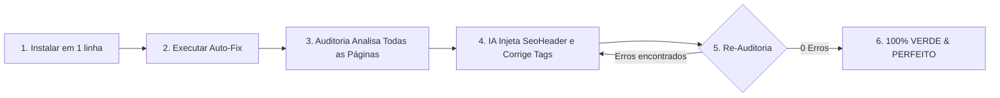

<div align="center">

# 🚀 SEO-FORGE
### Universal SEO & GEO Autonomous Toolkit for AI Coding Agents
**Win Google Top Rankings & ChatGPT/Perplexity AI Citations in 1 Line of Code**

[](LICENSE)
[](https://dotnet.microsoft.com/)
[](https://dotnet.microsoft.com/apps/aspnet/web-apps/blazor)
[](https://github.com/CW-Software-Apps/seo-forge)
[](https://claude.ai/)
[](https://deepmind.google/)
[](https://cursor.com/)
[](https://www.bing.com/indexnow)

<p align="center">
  <b>Desenvolvido com excelência pela <a href="https://cwsoftware.com.br">CW Software</a></b>
</p>

[🇧🇷 Português](#-português) • [🎯 A Principal Utilidade (Auto-Fix)](#-a-principal-utilidade-o-ciclo-autônomo-100-perfeito) • [🤖 Como usar no OpenCode](#-como-usar-no-opencode) • [🇺🇸 English](#-english)

---

</div>

## ⚡ Instalação em 1 Linha (Instant Setup)

Abra o terminal na pasta raiz do seu projeto e execute:

### Windows (PowerShell):
```powershell
irm https://raw.githubusercontent.com/CW-Software-Apps/seo-forge/main/install.ps1 | iex
```

### Linux / macOS (Bash):
```bash
curl -fsSL https://raw.githubusercontent.com/CW-Software-Apps/seo-forge/main/install.sh | bash
```

> **O que o instalador faz em 3 segundos:**
> 1. Instala as 5 skills globais do **Antigravity** (`~/.gemini/config/skills/`).
> 2. Detecta se o seu projeto é **Blazor/.NET** e injeta os componentes `<SeoHeader.razor>`, `<JsonLd.razor>` e o serviço C# `IndexNowService.cs`.
> 3. Injeta instruções nativas para **OpenCode** (`AGENTS.md`), **Claude Code** (`CLAUDE.md`, `/seo-fix`), **Cursor/Windsurf** (`.cursor/rules/seo.mdc`) e **GitHub Copilot**.
> 4. Injeta o validador com auto-cura em `scripts/seo_checker.py`.

---

# 🎯 A PRINCIPAL UTILIDADE: O Ciclo Autônomo (100% Perfeito)

O verdadeiro poder do **SEO-FORGE** não é apenas fornecer regras, mas sim o **Loop de Auto-Cura Autônomo**:



Você **não precisa** passar página por página adicionando tags manualmente. A IA ou o script executam o ciclo completo até garantir nota 100%.

---

# 🤖 COMO USAR NO OPENCODE

O **OpenCode** suporta nativamente o arquivo [AGENTS.md](AGENTS.md) gerado pelo SEO-FORGE.

### Modo 1: Mandando a IA do OpenCode fazer TUDO no Chat (Recomendado)
Após rodar o instalador de 1 linha no projeto, abra o **OpenCode** e digite no chat:

> *"@agent leia o AGENTS.md, execute o ciclo de auto-fix e corrija todo o SEO do projeto até ficar 100% perfeito."*  
> ou simplesmente:  
> **`corrija todo o SEO do projeto até ficar 100%`**

#### O que o OpenCode fará sozinho:
1. Executa `python scripts/seo_checker.py .` no terminal integrado.
2. Identifica todas as páginas com metadados, títulos ou Open Graph ausentes.
3. Edita cada arquivo `.razor` ou `.html`, inserindo o componente `<SeoHeader>` com títulos e descrições semânticas.
4. Ajusta hierarquias de `<h1>` e adiciona `alt` em imagens.
5. Re-executa o teste até o resultado ser:  
   `[OK] 100% PERFECT! No SEO issues found across all analyzed pages!`

### Modo 2: Auto-Fix Imediato pelo Terminal do OpenCode
Se você quiser que o script faça a injeção instantânea via código antes de chamar a IA:
```bash
python scripts/seo_checker.py . --fix
```
O script injeta automaticamente os componentes `<SeoHeader>` e tags básicas nas páginas afetadas em menos de 1 segundo!

---

# 🌐 COMO USAR NAS DEMAIS IAs

### 1. No Claude Code (CLI)
O SEO-FORGE instala um **Slash Command nativo** para o Claude Code. No terminal do Claude Code, digite:
```bash
/seo-fix
```
O Claude Code assume a execução do loop autônomo e só finaliza quando o projeto estiver 100% em conformidade.

### 2. No Google Antigravity
No chat do Antigravity, chame o agente especialista:
> *"@seo-specialist execute o auto-fix em todas as páginas e garanta 100% de conformidade."*

### 3. No Cursor & Windsurf
Graças à regra `.cursor/rules/seo.mdc` e ao `AGENTS.md`, basta abrir o Composer (`Ctrl+I` ou `Cmd+I`) e digitar:
> *"Execute scripts/seo_checker.py e corrija todas as páginas afetadas com base nas regras do seo.mdc até 100%."*

---

# 🇧🇷 Português

### 🎯 Diferenciais Exclusivos do SEO-FORGE

- ⚡ **IndexNow Nativo**: Notifica Bing, Microsoft Copilot e ChatGPT Search instantaneamente quando uma página é criada ou alterada.
- 🌐 **Prerendering & Blazor SSR**: Resolve o problema histórico de páginas Blazor renderizarem vazias para robôs de busca.
- 🤖 **Universalidade Total**: Funciona com **OpenCode**, **Claude Code**, **Antigravity**, **Cursor**, **Windsurf** e **Copilot**.
- 📊 **GEO (Generative Engine Optimization)**: Estruturas de informação otimizadas para citação no ChatGPT, Perplexity e Claude.

---

### 🧩 As 5 Skills Especializadas

| Skill | Escopo | Destaques |
|---|---|---|
| **`technical-seo`** | Infraestrutura & Rastreamento | Protocolo **IndexNow**, Blazor Static SSR, `<HeadOutlet>`, `robots.txt` e `sitemap.xml` dinâmicos, Core Web Vitals (LCP, INP, CLS). |
| **`schema-markup`** | Rich Snippets & Dados Estruturados | Componente `<JsonLd>` e schemas Schema.org: `SoftwareApplication`, `Organization`, `WebSite`, `FAQPage`, `BreadcrumbList`. |
| **`open-graph-social`** | Compartilhamento Social | Cards otimizados para WhatsApp, LinkedIn, Twitter/X, Slack; proporção 1200x630, safe zone central e imagens de alta resolução. |
| **`content-seo`** | Semântica & Redação de Alto CTR | Hierarquia estrita H1-H6, tags HTML5 semânticas (`<main>`, `<article>`), copywriting focado em conversão para Title e Meta Description. |
| **`geo-search-optimization`** | Motores de IA (GEO) | Estratégias para ranquear no ChatGPT Search e Perplexity; pontuação de *information gain*, densidade de entidades e links de autoridade. |

---

### 💻 Exemplo em Blazor (.NET 8/9/10)

```razor
@page "/solucoes/gestao-empresarial"
@using CWSoftware.Web.Components.Shared

<!-- Metadados de SEO, Open Graph e Twitter Cards automáticos -->
<SeoHeader 
    Title="Sistema de Gestão Empresarial ERP"
    Description="Automatize processos, estoque e finanças em tempo real com o ERP em nuvem da CW Software."
    CanonicalUrl="https://cwsoftware.com.br/solucoes/gestao-empresarial"
    OgImage="https://cwsoftware.com.br/images/og/gestao.jpg" />

<!-- Dados Estruturados Schema.org JSON-LD (Rich Snippets) -->
<JsonLd SchemaData="@FaqData" />

<h1>Sistema de Gestão Empresarial ERP em Nuvem</h1>
```

---

### ⚡ Notificação Instantânea com IndexNow em C#

```csharp
public class BlogPostService
{
    private readonly IIndexNowService _indexNow;

    public BlogPostService(IIndexNowService indexNow)
    {
        _indexNow = indexNow;
    }

    public async Task PublishPostAsync(BlogPost post)
    {
        await _db.SaveChangesAsync();

        // Notifica Bing, Copilot e ChatGPT Search instantaneamente!
        await _indexNow.NotifyUrlChangedAsync($"https://cwsoftware.com.br/blog/{post.Slug}");
    }
}
```

---

# 🇺🇸 English

**SEO-FORGE** is a unified SEO & GEO (Generative Engine Optimization) autonomous toolkit designed for AI coding agents (**OpenCode**, **Claude Code**, **Antigravity**, **Cursor**, **Windsurf**, and **GitHub Copilot**) with first-class support for **Blazor (.NET 8/9/10)** and modern web applications.

### 🌟 Highlights
- **1-Line Quickstart**: Automatically sets up all AI agents and project templates.
- **Autonomous Auto-Fix**: Direct your AI agent to audit and iteratively remediate missing metadata until 100% green.
- **IndexNow Protocol**: Instant indexing for Microsoft Bing, Copilot, and ChatGPT Search.
- **Blazor SSR & Prerender First**: Guarantees crawler bots receive fully rendered `<title>`, `<meta>`, and Open Graph tags on the initial HTTP response.

---

## 📄 Licença

Distribuído sob a licença **MIT**. Veja [LICENSE](LICENSE) para mais detalhes.

---

<div align="center">
  <sub>Criado com orgulho pela equipe de engenharia da <b><a href="https://cwsoftware.com.br">CW Software</a></b></sub>
</div>
